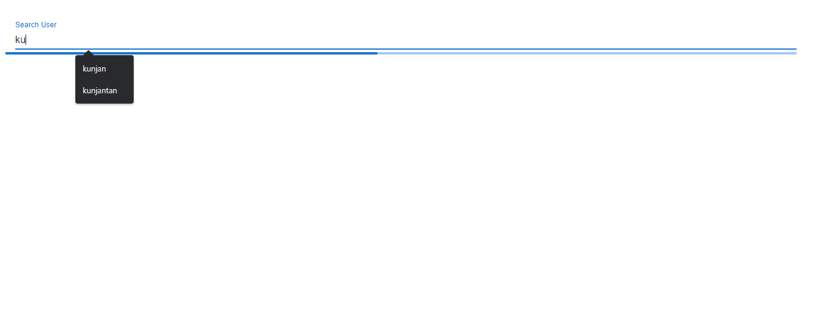
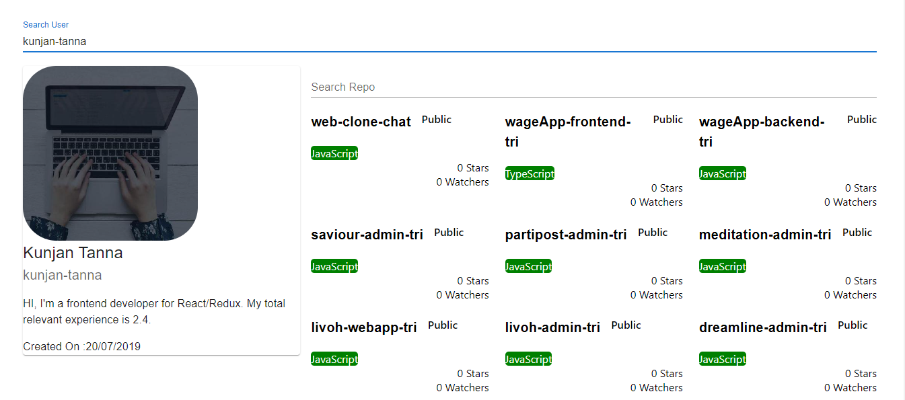
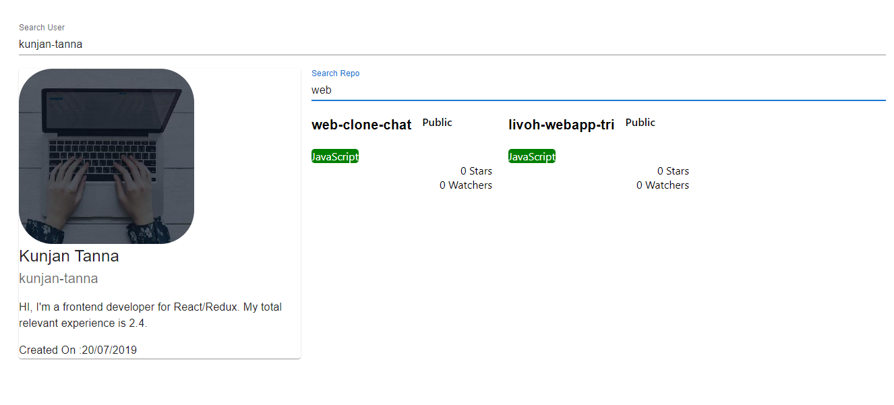

# Display Repository and User

In the project directory, you can run:

### `npm start`

Runs the app in the development mode.\
Open [http://localhost:3000](http://localhost:3000) to view it in your browser.

The page will reload when you make changes.\
You may also see any lint errors in the console.

## Video Link

-  Github: https://share.vidyard.com/watch/PtN5LyE12Vr4aPpUixbaZi?

## Setup

To run this project, install it locally using npm:

```
$ npm install
$ npm start
```

## Technologies

Project is created with:

-  React
-  Javascript

## Screenshots

<table>
  <tr>
    <tr>
    <th>Desktop</th>
    </tr>
  </tr>
    <td> </td>
    <td></td>
    <td></td>
   </tr> 
      
</table>
